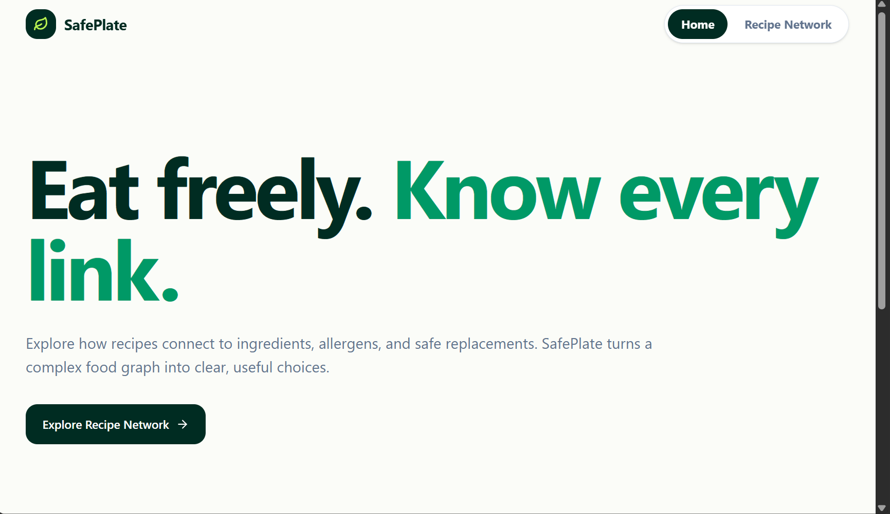
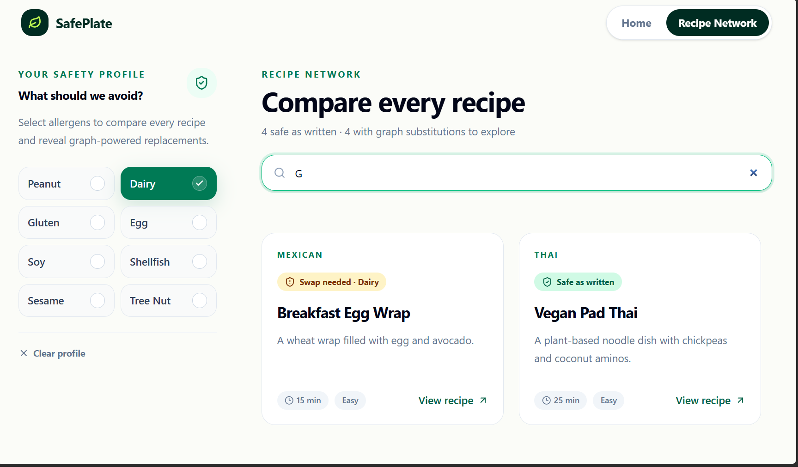
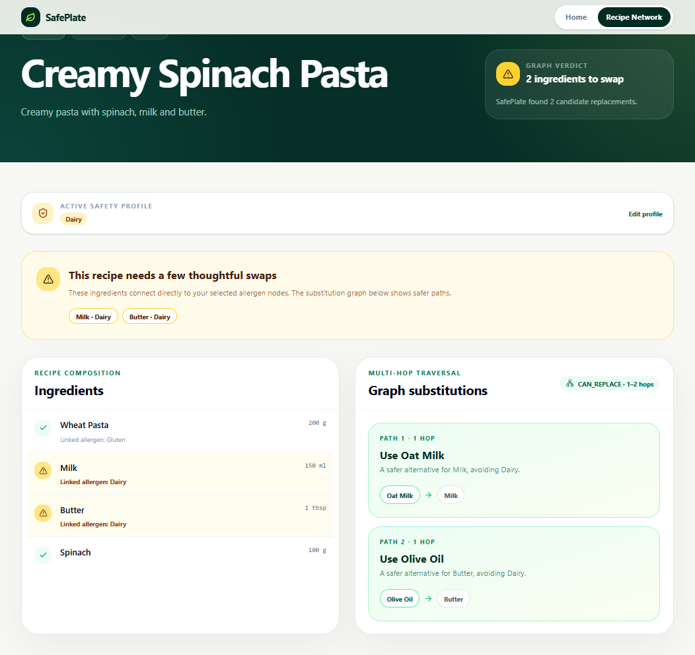
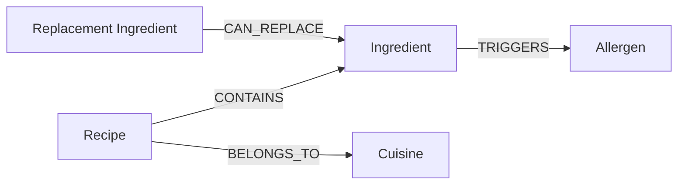

# SafePlate

SafePlate is a graph-powered recipe explorer built with Next.js and CognoDB. It
shows whether a recipe conflicts with selected allergens and finds safer
ingredient substitutions through one-hop and two-hop graph traversals.

## Links

- **Live application:** [wexa-ai-sepia.vercel.app](https://wexa-ai-sepia.vercel.app/)
- **Demo video:** [Google Drive link - recording](https://drive.google.com/file/d/1piJjsYcMMr-BOFvVmn8ZRgJnIqzBRjGh/view?usp=sharing)

## Screenshots

### Landing page



### Recipe Network



### Recipe details and substitutions



## Use case

People with food allergies need to understand connections between recipes,
ingredients, allergens, and possible replacements. SafePlate lets a user select
allergens, compare safe and conflicting recipes, inspect the exact conflict, and
follow graph-powered substitution paths.

### Features

- Select one or more allergens to create a temporary safety profile.
- Compare safe and conflicting recipes without hiding either group.
- See which ingredients connect to selected allergens.
- Find safe one-hop and two-hop `CAN_REPLACE` substitution paths.
- Search recipes by name, description, or cuisine.

## Graph model



### Nodes and properties

| Label | Main properties |
| --- | --- |
| `Recipe` | `id`, `name`, `description`, `difficulty`, `prepMinutes` |
| `Ingredient` | `id`, `name` |
| `Allergen` | `id`, `name` |
| `Cuisine` | `id`, `name` |

### Relationships

- `Recipe-[:CONTAINS {quantity, unit, optional}]->Ingredient`
- `Recipe-[:BELONGS_TO]->Cuisine`
- `Ingredient-[:TRIGGERS]->Allergen`
- `ReplacementIngredient-[:CAN_REPLACE {notes}]->Ingredient`

## Why a graph database?

SafePlate's useful answers depend on paths rather than isolated rows. The app
moves from a recipe to its ingredients and allergens, then traverses direct or
multi-hop replacement relationships. Cypher expresses this variable-length
traversal directly; a relational version would require several join tables and
recursive or repeated self-joins that become harder to extend and explain.

## Tech stack

- Next.js 16, React 19, and TypeScript
- Tailwind CSS 4
- CognoDB Cloud
- Official `neo4j-driver`
- Parameterized Cypher queries

Prisma and Drizzle are not used because this project uses a graph database.
CognoDB is accessed from server-side Next.js Route Handlers through the official
Neo4j JavaScript driver.

## Local setup

### 1. Install dependencies

```bash
npm install
```

### 2. Configure CognoDB

1. Create an account at [console.cognodb.com/signup](https://console.cognodb.com/signup).
2. Create a free `c0` instance and choose a region.
3. Save the generated password; it is displayed only once.
4. Copy the `bolt+s://...databases.cognodb.cloud` connection URI.
5. Use the username `cognodb` with the generated password.

Copy `.env.example` to `.env.local` and add your credentials:

```env
COGNODB_URI=bolt+s://your-instance-id.databases.cognodb.cloud
COGNODB_USERNAME=cognodb
COGNODB_PASSWORD=your-password
```

Do not commit `.env.local`.

### 3. Seed the graph

```bash
npm run seed
```

The seed uses parameterized `UNWIND` queries and `MERGE`, so it can be rerun
without duplicating data. To clear a dedicated assignment database and reseed:

```bash
npm run seed:reset
```

### 4. Run the application

```bash
npm run dev
```

Open [http://localhost:3000](http://localhost:3000).

## Main queries

### Recipe safety comparison

Loads every recipe and its connected allergens, then uses the parameterized
`$excludedAllergens` list to return `hasConflict` and `matchedAllergens`. Safe
and conflicting recipes remain visible so the user can compare them.

### Recipe details

Traverses `Recipe -> CONTAINS -> Ingredient -> TRIGGERS -> Allergen` and returns
ingredient quantities, units, optional flags, and allergen connections for one
parameterized `$recipeId`.

### Multi-hop safe substitutions

The substitution query starts with an ingredient that triggers a selected
allergen, traverses one or two `CAN_REPLACE` relationships, and rejects any
replacement that triggers another selected allergen.

```cypher
MATCH (r:Recipe {id: $recipeId})-[:CONTAINS]->(unsafe:Ingredient)
MATCH (unsafe)-[:TRIGGERS]->(blocked:Allergen)
WHERE blocked.name IN $excludedAllergens

MATCH path = (replacement:Ingredient)-[:CAN_REPLACE*1..2]->(unsafe)
WHERE NOT EXISTS {
  MATCH (replacement)-[:TRIGGERS]->(replacementAllergen:Allergen)
  WHERE replacementAllergen.name IN $excludedAllergens
}

RETURN DISTINCT
  unsafe.name AS unsafeIngredient,
  blocked.name AS allergen,
  replacement.name AS replacement,
  length(path) AS hops
ORDER BY hops, replacement
LIMIT 20
```

All user-controlled values are passed as Cypher parameters instead of being
concatenated into query strings.

## Validation

```bash
npm run lint
npx tsc --noEmit
npm run build
```

The dataset and query limits are intentionally small for the CognoDB `c0` free
tier. The driver is reused, its connection pool is limited, and traversal depth
and result counts are bounded.

## Deployment

The application is deployed on Vercel. The production project requires these
environment variables:

- `COGNODB_URI`
- `COGNODB_USERNAME`
- `COGNODB_PASSWORD`

After deployment, `/api/health` should return `status: ok` and
`database: connected`.
