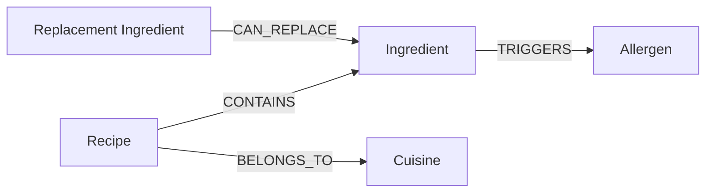

# SafePlate 🥗

SafePlate is a graph-powered recipe discovery web application that helps users find allergen-safe meals and discover ingredient substitutions using graph relationship traversals in Neo4j / CognoDB.

## Links

- **GitHub Repository:** [https://github.com/KOUSHIKG04/wexa-ai](https://github.com/KOUSHIKG04/wexa-ai)
- **Hosted Demo:** [https://safeplate.vercel.app](https://safeplate.vercel.app) *(Replace with your deployed URL)*
- **Screen Recording:** [Demo Video Link](https://youtube.com) *(Replace with your video link)*

---

## Screenshots

| Recipe Explorer | Recipe Details & Graph Substitutions |
|---|---|
|  |  |

---

## Graph data model



---

## Why a graph database?

SafePlate's primary data is not just recipes and ingredients, but the relationships connecting recipes, ingredients, allergens, cuisines and possible substitutions.

A graph database allows the application to traverse from a recipe to an unsafe ingredient, then to its allergen and through one or more possible replacement ingredients. Variable-length substitution paths can be expressed directly in Cypher.

A relational implementation would require several join tables, recursive queries and increasingly complicated filtering logic as new relationship types are introduced.

---

## Setup & Installation Instructions

### 1. CognoDB / Neo4j Creation
Set up a CognoDB or Neo4j database instance:
- **Cloud (Neo4j AuraDB / CognoDB):** Create a free instance on [Neo4j AuraDB](https://neo4j.com/cloud/aura/) or your CognoDB provider and record the Connection URI, Username, and Password.
- **Local (Docker / Neo4j Desktop):** Run a local container:
  ```bash
  docker run -d --name safeplate-db -p 7474:7474 -p 7687:7687 -e NEO4J_AUTH=neo4j/password123 neo4j:latest
  ```

### 2. Environment Variables Setup
Create a `.env.local` file in the root directory:

```env
COGNODB_URI=bolt://localhost:7687
COGNODB_USERNAME=neo4j
COGNODB_PASSWORD=password123
```

### 3. Install Dependencies
```bash
npm install
```

### 4. Seed the Graph Database
Run the seed script to populate nodes (`Recipe`, `Ingredient`, `Allergen`, `Cuisine`) and relationships (`CONTAINS`, `BELONGS_TO`, `TRIGGERS`, `CAN_REPLACE`):
```bash
npm run seed
```

### 5. Run Development Server
Start the Next.js local development server:
```bash
npm run dev
```
Open [http://localhost:3000](http://localhost:3000) in your browser.

---

## Cypher Queries Explanation

SafePlate relies on three core Cypher queries located in [`src/lib/queries.ts`](file:///d:/safeplate/src/lib/queries.ts):

### 1. Recipe Discovery Query (`LIST_RECIPES_QUERY`)
Matches all recipes, optional cuisines, and allergens triggered by ingredients. It dynamically filters out recipes containing any user-selected excluded allergens (`$excludedAllergens`) using Cypher's `NONE()` predicate.

```cypher
MATCH (r:Recipe)
OPTIONAL MATCH (r)-[:BELONGS_TO]->(c:Cuisine)
OPTIONAL MATCH (r)-[:CONTAINS]->(:Ingredient)-[:TRIGGERS]->(a:Allergen)
WITH r, c, collect(DISTINCT a.name) AS recipeAllergens
WHERE size($excludedAllergens) = 0
   OR NONE(allergen IN recipeAllergens WHERE allergen IN $excludedAllergens)
RETURN r.id AS id, r.name AS name, r.description AS description, r.difficulty AS difficulty,
       r.prepMinutes AS prepMinutes, coalesce(c.name, "Other") AS cuisine, recipeAllergens AS allergens
ORDER BY r.name
LIMIT $limit
```

### 2. Recipe Details Query (`RECIPE_DETAILS_QUERY`)
Retrieves full details for a single recipe by `$recipeId`, including all ingredients, quantities, units, optional flags, and the specific allergens triggered by each ingredient.

```cypher
MATCH (r:Recipe {id: $recipeId})
MATCH (r)-[contains:CONTAINS]->(i:Ingredient)
OPTIONAL MATCH (i)-[:TRIGGERS]->(a:Allergen)
WITH r, i, contains, collect(DISTINCT a.name) AS ingredientAllergens
WITH r, collect({
  id: i.id, name: i.name, quantity: contains.quantity, unit: contains.unit,
  optional: contains.optional, allergens: ingredientAllergens
}) AS ingredients
OPTIONAL MATCH (r)-[:BELONGS_TO]->(c:Cuisine)
RETURN r.id AS id, r.name AS name, r.description AS description, r.difficulty AS difficulty,
       r.prepMinutes AS prepMinutes, coalesce(c.name, "Other") AS cuisine, ingredients
```

### 3. Safe Substitutions Query (`SAFE_SUBSTITUTIONS_QUERY`)
Finds unsafe ingredients in a recipe that trigger any user-selected excluded allergens and performs variable-length graph traversals (`[:CAN_REPLACE*1..2]`) to discover alternative replacement ingredients that do not trigger any of the user's excluded allergens.

```cypher
MATCH (r:Recipe {id: $recipeId})-[:CONTAINS]->(unsafe:Ingredient)
MATCH (unsafe)-[:TRIGGERS]->(blocked:Allergen)
WHERE blocked.name IN $excludedAllergens
MATCH path = (replacement:Ingredient)-[:CAN_REPLACE*1..2]->(unsafe)
WHERE NOT EXISTS {
  MATCH (replacement)-[:TRIGGERS]->(replacementAllergen:Allergen)
  WHERE replacementAllergen.name IN $excludedAllergens
}
RETURN DISTINCT unsafe.name AS unsafeIngredient, blocked.name AS allergen,
                replacement.name AS replacement, length(path) AS hops
ORDER BY hops, replacement
```

---

## Known Limitations & Future Improvements

- **Fixed Hop Traversal:** The substitution graph search currently limits path traversal to 1–2 hops (`CAN_REPLACE*1..2`). This can be expanded with weight/cost scores for multi-hop substitution quality.
- **Cross-Allergen Sensitivity:** Secondary sensitivities across ingredient categories could be modeled with weighted similarity nodes.
- **User Preference Memory:** Adding user profile nodes and saving personal allergen profiles to the graph database.
- **Community Substitutions:** Allowing users to submit custom substitution pathways with community upvoting.
