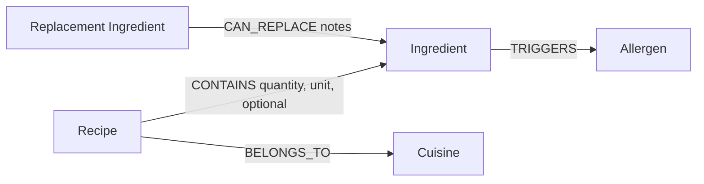

# SafePlate

SafePlate is a graph-powered recipe explorer that helps people understand how recipes, ingredients, allergens, and safer substitutions are connected. It uses CognoDB as its graph database and the official Neo4j JavaScript driver over Bolt.

## Submission links

- GitHub repository: https://github.com/KOUSHIKG04/wexa-ai
- Live application: **Add the Vercel URL after deployment**
- Demo video: **Add the public video URL before submission**

> Submission reminder: keep the CognoDB instance active and verify that both
> links can be opened in a private/incognito browser window.

## Use case

Food-allergy decisions are relationship-heavy. A recipe contains ingredients; ingredients may trigger allergens; alternative ingredients can replace unsafe ones through direct or multi-step substitution paths. SafePlate turns those connections into a simple experience for non-technical users.

Users can:

- Build a temporary allergen safety profile.
- Compare every recipe as "Safe as written" or "Swap needed."
- Inspect the exact ingredients connected to a selected allergen.
- Explore safe one-hop and two-hop `CAN_REPLACE` paths.
- Search recipes by name, description, or cuisine.

## Why a graph database?

The useful part of SafePlate is not a single recipe or ingredient row; it is the path between them. CognoDB lets the application traverse:

```text
Recipe -> Ingredient -> Allergen
                    <- CAN_REPLACE <- Replacement Ingredient
```

Variable-length Cypher patterns express one-hop and two-hop substitutions directly. A relational implementation would require several join tables plus recursive or repeated self-joins, and it would become harder to extend when new relationship types are introduced.

## Graph data model



### Nodes

- `Recipe`: `id`, `name`, `description`, `difficulty`, `prepMinutes`
- `Ingredient`: `id`, `name`
- `Allergen`: `id`, `name`
- `Cuisine`: `id`, `name`

### Relationships

- `Recipe-[:CONTAINS]->Ingredient`
- `Recipe-[:BELONGS_TO]->Cuisine`
- `Ingredient-[:TRIGGERS]->Allergen`
- `ReplacementIngredient-[:CAN_REPLACE]->OriginalIngredient`

## Application architecture

```text
Browser
  -> Next.js pages and client components
  -> Next.js Route Handlers
  -> Official neo4j-driver
  -> CognoDB over bolt+s
```

Database credentials remain on the server. The browser only communicates with the public Next.js API routes.

## Technology stack

- Next.js 16 App Router
- React 19 and TypeScript
- Tailwind CSS 4
- Official `neo4j-driver`
- CognoDB Cloud
- Lucide icons and Base UI components

The project does not use Prisma or Drizzle. Those tools target relational
databases; SafePlate connects to CognoDB with the official Neo4j driver and
executes parameterized Cypher from server-only Next.js Route Handlers.

## Project structure

```text
src/
  app/
    api/health/route.ts
    api/recipes/route.ts
    api/recipes/[id]/route.ts
    recipes/page.tsx
    recipes/[id]/page.tsx
    page.tsx
  components/
    RecipeExplorer.tsx
    RecipeDetails.tsx
    SiteHeader.tsx
  lib/
    db.ts
    queries.ts
    types.ts
scripts/
  seed.ts
```

## Main Cypher queries

All dynamic values are passed as parameters. The application never concatenates user input into Cypher.

### Recipe safety comparison

The discovery query loads recipes and their allergen connections, then calculates whether any recipe allergen appears in `$excludedAllergens`.

```cypher
MATCH (r:Recipe)
OPTIONAL MATCH (r)-[:BELONGS_TO]->(c:Cuisine)
OPTIONAL MATCH (r)-[:CONTAINS]->(:Ingredient)-[:TRIGGERS]->(a:Allergen)
WITH r, c, collect(DISTINCT a.name) AS recipeAllergens
RETURN
  r.id AS id,
  r.name AS name,
  recipeAllergens AS allergens,
  any(
    allergen IN recipeAllergens
    WHERE allergen IN $excludedAllergens
  ) AS hasConflict,
  [
    allergen IN recipeAllergens
    WHERE allergen IN $excludedAllergens
  ] AS matchedAllergens
ORDER BY hasConflict DESC, r.name
LIMIT $limit
```

### Recipe details

The details query traverses `Recipe -> CONTAINS -> Ingredient -> TRIGGERS -> Allergen` and returns ingredient quantities, optional flags, and allergen connections.

### Multi-hop safe substitutions

This is the graph-specific query that would be awkward in a relational schema. It traverses up to two `CAN_REPLACE` relationships and excludes replacements that trigger any selected allergen.

```cypher
MATCH (r:Recipe {id: $recipeId})-[:CONTAINS]->(unsafe:Ingredient)
MATCH (unsafe)-[:TRIGGERS]->(blocked:Allergen)
WHERE blocked.name IN $excludedAllergens

MATCH path = (replacement:Ingredient)-[:CAN_REPLACE*1..2]->(unsafe)

WHERE NOT EXISTS {
  MATCH (replacement)-[:TRIGGERS]->(replacementAllergen:Allergen)
  WHERE replacementAllergen.name IN $excludedAllergens
}

RETURN DISTINCT
  unsafe.name AS unsafeIngredient,
  blocked.name AS allergen,
  replacement.name AS replacement,
  length(path) AS hops
ORDER BY hops, replacement
LIMIT 20
```

## Set up CognoDB Cloud

1. Create an account at https://console.cognodb.com/signup.
2. Create a free `c0` database instance and select a region.
3. Save the generated password immediately; it is shown only once.
4. Copy the `bolt+s://<instance-id>.databases.cognodb.cloud` URI.
5. Use the generated password with username `cognodb`.

## Local setup

### 1. Install dependencies

```bash
npm install
```

### 2. Configure environment variables

Copy `.env.example` to `.env.local` and provide your CognoDB credentials:

```env
COGNODB_URI=bolt+s://your-instance-id.databases.cognodb.cloud
COGNODB_USERNAME=cognodb
COGNODB_PASSWORD=your-generated-password
```

Never commit `.env.local`.

### 3. Load seed data

The seed script uses batched, parameterized `UNWIND` queries and `MERGE`, so normal reruns do not create duplicate nodes or relationships.

```bash
npm run seed
```

To delete all data in the configured database and reseed it:

```bash
npm run seed:reset
```

`seed:reset` is destructive. Use it only with a dedicated assignment database.

### 4. Start the application

```bash
npm run dev
```

Open http://localhost:3000.

- Landing page: `/`
- Recipe Network: `/recipes`
- Database health check: `/api/health`

## Quality checks

```bash
npm run lint
npx tsc --noEmit
npm run build
```

The UI includes:

- Responsive desktop and mobile layouts.
- Loading skeletons.
- Search empty states.
- "Safe as written," "Swap needed," and "No safe path" graph states.
- Graceful database-unavailable states with retry actions.
- Keyboard focus styles and semantic navigation.

## Free-tier considerations

- The Neo4j driver is reused instead of being recreated per request.
- The connection pool is capped at five connections.
- Seed writes are batched with `UNWIND`.
- Result sets and traversal depths are bounded.
- Images and recordings are not stored in CognoDB.

## Publish to Vercel

### 1. Complete the pre-deployment checks

Run these commands from the project root:

```bash
npm install
npm run seed
npm run lint
npx tsc --noEmit
npm run build
```

The Vercel deployment uses the same CognoDB database. The seed command only
needs to be run from your local machine; it should not be added to the Vercel
build command.

### 2. Push the project to GitHub

Confirm that `.env.local` is not staged, then commit and push the source code:

```bash
git status
git add .
git commit -m "Complete SafePlate assignment"
git push origin main
```

If your current branch is not `main`, push that branch and select it as the
production branch in Vercel.

### 3. Import the repository into Vercel

1. Sign in at https://vercel.com using GitHub.
2. Select **Add New > Project**.
3. Import `KOUSHIKG04/wexa-ai`.
4. Leave the framework preset as **Next.js**.
5. Keep the root directory as the repository root.
6. Keep the default install and build commands.

No `vercel.json` file or custom adapter is required.

### 4. Add production environment variables

In the Vercel project, open **Settings > Environment Variables** and add:

| Name | Value |
| --- | --- |
| `COGNODB_URI` | Your `bolt+s://...databases.cognodb.cloud` URI |
| `COGNODB_USERNAME` | `cognodb` |
| `COGNODB_PASSWORD` | Your CognoDB password |

Enable the variables for **Production**. You may also enable **Preview** if you
want branch deployments to connect to the database. Never paste these secrets
into the README or commit `.env.local`.

### 5. Deploy and verify

Select **Deploy**. After Vercel provides a URL, verify these pages:

1. `https://YOUR-PROJECT.vercel.app/api/health` returns a JSON response with
   `"status": "ok"` and `"database": "connected"`.
2. `/` opens the landing page.
3. `/recipes` loads all eight recipes.
4. Select **Dairy**, open **Spinach Paneer Curry**, and confirm the dairy
   conflict plus the one-hop and two-hop substitutions.

If you add or change an environment variable after deployment, redeploy the
application because existing deployments do not receive the new value.

### 6. Update this README

Replace the two placeholders in **Submission links** with:

- The final public `vercel.app` URL.
- The public demo-video URL after recording it.

Push that README update to GitHub. Vercel will automatically create a new
production deployment when the production branch changes.

## Demo video (add later)

Record a 2–4 minute walkthrough showing:

1. The landing page and Recipe Network navigation.
2. Allergen selection and safe versus conflicting recipes.
3. The Dairy conflict in Spinach Paneer Curry.
4. A one-hop substitution and a two-hop substitution.
5. A brief explanation of the node labels and relationships in the graph model.

Upload the recording somewhere reviewers can access without requesting
permission, then paste its public URL into **Submission links**.

## Screenshots

Before submission, add current screenshots at:

- `public/screenshot-home.png`
- `public/screenshot-network.png`
- `public/screenshot-details.png`

Then embed them in this section.

## Known limitations and future improvements

- The included seed is intentionally small and curated for the CognoDB free tier.
- Substitution paths are limited to two hops to keep recommendations explainable.
- Future versions could add weighted substitution quality, saved user profiles, and community-reviewed alternatives.
